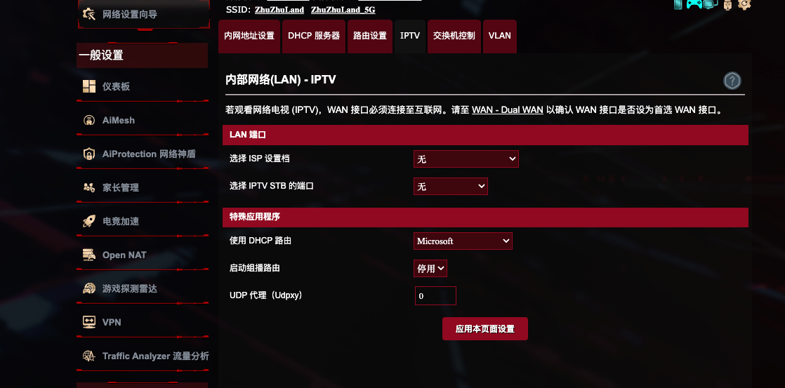
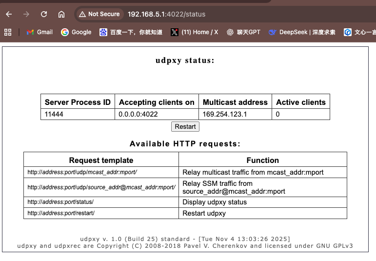
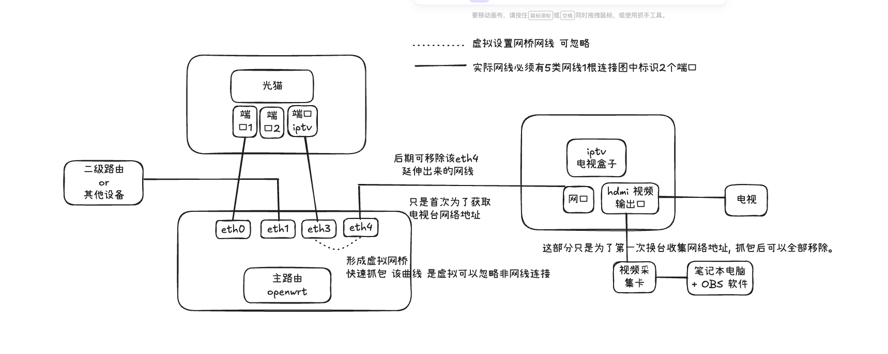
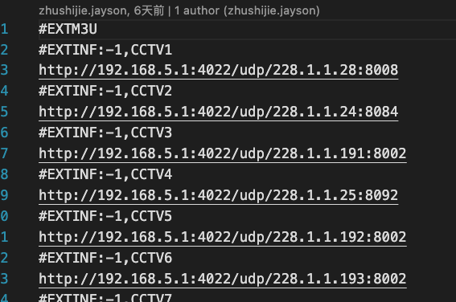

# 如何使用 Udpxy 的路由器去收看IPTV--告别电视盒子

## 目的

<p>
  当前IPTV在三大运营商下，已经是平均月收入为10元，一年收费120元左右，但是由于流媒体的盛行，很多老年人和年轻人的观看渠道进行了分流，但是很多家里有老人的家庭，一直苦于大多数 iptv 盒子必须用网线，或者使用猫棒，以及弱电箱无布线到电视柜等多种问题，导致IPTV实际收看很低。但是！如果你看完了今天的文章，我就可以让你把“电视节目”完全脱离“电视盒子”。让你在主流全平台随意收看电视节目，家里有几台电视都可以，任何终端包括 iphone android ipad windows,linux,macos 甚至是 steamdeck 都可以看 iptv。 
</p>

-----

## 背景(适用人群)

硬件要求：

 *  一台拥有udpx的路由器，可以是 openwrt | ikuai 的软路由,也可以是 AGUS华硕带有 IPTV口的 家用路由。(个人推荐软路由，本教程主要参考软路由编写!)
 *  1根5类+的网线
 * 光猫可以是 桥接模式 亦可是 路由模式(不懂的可以忽略)
 * 光猫离电视较远的，需要有1块采集卡，如果没有软路由的，需要准备一个2个网口以上的笔记本电脑，2个USB拓展网卡也可以。
 * 如果 需要再 iphone or ipad 上观看，需要家里有一台电脑或者服务器当做 转码服务器。远程 udp 的 ts包无法再 iphone上解析。本人提供一键部署转码服务器。

----
软件要求: 
 * 需要懂基本的SSH 基本知识 (华硕等硬路由的用户可以忽略!)
 * 收看终端，手机 | 电脑 必须安装类似 VLC 媒体的播放器。VLC本身是全平台支持的。
 * 软路由必须安装好 igmpproxy udpxy (华硕等硬路由的用户可以忽略!路由器内部已经内置)

---- 

软路由安装步骤介绍

```sh
$: opkg install igmpproxy

$: opkg install udpxy

```

华硕路由器udpxy 截图 仅效果可忽略


软路由udpxy 截图 仅效果可忽略


<b>如何验证： 一旦成功开启udpxy 截图显示如下 (具体安装后的开启方法，请阅后“使用udpxy”文章部分) </b>


----

## 原理讲解（必须详细阅读，更好的了解 架构图 和 后期命令）

### 什么是 iptv 组播，什么是igmp请求？

<p>
你可以理解为是服务商通过 udp || rtp (特殊的udp封装，本质还是udp协议),进行无差别广播的 一组一组的数据包，但是你不用担心，这些广播的数据包并不会随时把你的宽带带宽占满，因为广播的数据包下发条件需要通过 igmp 向 udp源服务器请求，udp建立连接后才会下发 组播数据包。也就是电视节目的视频源数据。如果稍微懂一点计算机知识的，就了解你浏览一个网页，本质上是 一个个的 TCP 连接，和发送的 TCP基础上的 http请求。所以针对 IPTV这个场景，udp协议 和 igmp请求就是对应的业务关系。
igmpproxy 这个插件帮我们实现，从路由器里任意一个物理端口发出的 igmp(udp数据包)请求，都会被其他物理端口转发，比如我在路由器网口1发送的请求，或者wifi，或者网口2发送的请求，都会被转发到 网口3连通光猫iptv 那条网线上，从而获取真正的 udp响应，然后udpxy 会把udp响应，转变为 tcp响应也就是http响应，响应给对应的请求设备。

  示例：

  某台电脑发送一个http请求 -> http://192.168.5.1:4022/udp/228.1.1.28:8008 -> 网口1 -> udpxy -> udp://228.1.1.28:8008 -> igmp请求，位于网口1 -> igmpproyx 从网口1 -> 网口3 数据包转发请求 -> 光猫iptv 口 -> cctv1 小区udp服务器节点响应 -> 光猫 -> 网口3 -> 网口1 -> udpxy 在把udp的响应结果修改为 "http://192.168.5.1:4022/udp/228.1.1.28:8008" 的http响应结果.  -> 终端收到响应，解析数据播放视频。 

  当你用遥控器每次按到下一个台的时候，本质上就是电视盒子通过网线，向光猫端口发送了一个 igmp 的 udp请求。同时电视盒子还会发送一个 igmp 的离开上一个电视台的 udp请求，你可以观察到 udp的 数据包关闭了一组数据，同时建立了一个新的链接打开了一个udp链接。播放新的电视台视频信息。
</p>


### 为什么一定要抓取片源，而不是去网上寻找片源，地址是否经常会变动？

<p>
  因为每个服务商为了保证最好的看电视的流畅度会在你家附近，或者你的城市区县附近，部署很多CDN | UDP服务器源的 镜像节点，所以你在 github 或者 csdn上 寻找的别人爬好的电视台UDP地址列表一般不适用，除非你和另外一个人几乎是同小区，同服务商，唯独是单元或者楼号不同，但是共用一个光纤井。所以抓取片源我个人认为90%以上的人最好不要跳过这一步。然后就是一般电视片源的地址也是通过 udp请求下发的。但是电视台部署服务器全国的节点和机房一般是有成本的，一旦地址固定很少会去更换，所以我们一旦抓取好了电视台地址，并不需要每隔一个星期，或者几个月后重新抓取一遍。费时费力的情况是不存在的，另外我通过 观察电视盒子的程序观察得知，igmp(udp)请求的类型是有版本的，类似 http1.0 /http1.1 /http 2.0 ，而发出去请求的版本是写死的，考虑到运营商一般不会大面积更换已有的电视盒子，目前所有的 udp 请求的版本类型都是写死在电视盒子里的。 结论是 电信 和 移动使用的 igmp v2 的请求协议版本，而 联通比较高端，使用的 igmp v3 国际上大多通用的最先进的版本。当然请放心一般的 udpxy 转发 igmp请求时候，会自动探测你的 版本，并且透传对应你版本的请求。
</p>
<p>
  &nbsp;&nbsp;特别提醒中国很多udp服务器地址下并不是统一采用，8000,8008常用端口,有些4K高清电视台使用的是‘非’常规4000-3000左右的端口，所以抓取地址的时候一定要严格记录端口情况。
</p>

### 什么是网桥

<p>
  结论： 网桥就是一个虚拟在电脑里连接不同网口的网线。(可能解释的不准确但是为了让人快速理解抱歉。)
  
  在没有路由器和交换机的年代，电脑A 和电脑B 就是通过一个实际网线连接2台电脑并且做数据交换的。这种连接结构我们就称为“网桥”，而现在设置的网桥，实际上准确称呼为“虚拟网桥”。

  网桥网线连接的2端，并不一定要完全遵守 TCP/IP协议才可以相同，没有IP地址，也可以相通，并且转发UDP报文。这点要严格注意！。

</p>

## 如何获取 电视台片源 (不推荐跳过)

### 架构图

* 软路由架构图



~~~
软路由描述
  1. 至少软路由上需要空闲2个及2个以上的端口
  2. 我们需要把“光猫”的 iptv端口，连接任意软路由空闲端口 图里我连接的是3号口
  3. 我们需要把 软路由剩余空闲端口中其他中1个(图里是4号口)，连接运营商发给我们的 iptv 电视盒子
  4. 家里离电视近的，可以选择把电视盒子的 hdmi口，用hdmi 2.0+的线连接 电视，或者是，用电视盒子的hdmi口，连接自己的采集卡，然后把采集卡的输出口连接自己的笔记本电脑，在笔记本电脑上安装 OBS等直播推流软件，用于IPTV抓取电视台的时候，观察当前电视台是什么？已经是否在正常播放。
  5. 当所有电视台都通过 3号口 <-> 4号口的 软路由openwrt设置的网桥，抓取完毕后，即可移除4号口到电视盒子采集卡，以及笔记本电脑等一系列设备。
  6. 抓取过程，不会影响家里其他成员正常上网。可以放心“施工”，记录电视台 地址 和 端口号，尤其是端口号更容易被人忽略。
~~~

* 家用硬路由架构图


~~~
家用路由描述
   1. 把自己的笔记本可以是windows，也可以是macos。当然如果是linux也可以，拿网线连接到 光猫的iptv口。
   2。 笔记本若无剩余网卡，可通过 usb网卡+网线的形式，把 笔记本 + usb网卡 + 网线 + iptv电视盒子的网口 相连。
   3. 以上2部完成后，在 网络选项卡里，设置网桥。
   4. 后续步骤，参考软路由描述中 4,5,6 3个步骤。连接采集卡或者电视用于观测“电视抓包”。
   5. 笔记本安装 Wireshark 用于抓取 udp数据包。记录电视台 地址 和 端口号，尤其是端口号更容易被人忽略。
~~~

----

### 抓包教程

软路由 命令行教程（轮椅注释）

```sh
#!/bin/sh

# 一般的软路由端口都是从 eth0开始，这里设置 eth2,eth3 就是图示当中 3,4号口 ....|eth0,eth1,eth2,eth3|
# 在Linux系统中,每个端口都有 Up Down Wait 等状态，并不是你连上网线，有电信号过来，端口就启动了。需要命令手动让 端口UP
# 如果命令让端口UP 但实际没有连接任何网线，也不需要担心，一般系统一段时间后端口的状态自动会变为 Down.即为关闭。
ip link set eth2 up
ip addr show eth2
ip link set eth3 up
ip addr show eth3
# ip add show就是检查端口状态

# 增加一个虚拟网桥 “iptv” 用来连接 3号口 和 4号口，140,143行命令就是给 虚拟网桥添加两端的物理端口
ip link add name br-iptv type bridge 2>/dev/null || true
ip link set br-iptv up
ip link set eth2 master br-iptv
ip link set eth3 master br-iptv

# 如果网桥以前有本地地址就移除，如果没有则添加一个 169.xx.xx.xx的本地网址给网桥，因为udpxy启动的时候一定需要一个IP地址。
ip addr del 169.254.123.1/16 dev br-iptv 2>/dev/null || true
ip addr add 169.254.123.1/16 dev br-iptv
# PS!! 绝对不要在软路由的 UI界面 或者 用命令行，给eth2 eth3等添加任何IP地址，这样做UDP网桥是没有意义的，也不需要，只需要给网桥本身一个本地的IP地址就可以了。额外添加IP地址反而会使网桥广播混乱，从而无法播放电视节目。 

# Linux 就是这么手动低效的系统，必须设置ipv4下的数据包转发开启，也包含 ipv4 udp数据包转发。否则一般不设置 xx_forwarding=0 是不会在其他端口间转发数据包的。macos也是一样的。
sysctl -w net.ipv4.conf.all.mc_forwarding=1
sysctl -w net.ipv4.conf.default.mc_forwarding=1

# 强制设置 igmp转发请求的时候 query_version版本号为2，这里请注意你的服务商是 电信和移动的的时候要设置 2，！！但是联通一定要设置为 3
echo 2 >/proc/sys/net/ipv4/conf/br-iptv/force_igmp_version 2>/dev/null || true

# 查询是否已经有运行的 udpxy 进程和 igmpproxy 进程，如果有强制结束。方便下面后续重新启动。
pgrep -af udpxy | awk '{print $1}' | xargs -r kill -9 2>/dev/null || true
pgrep -af igmpproxy | awk '{print $1}' | xargs -r kill -9 2>/dev/null || true

# 启动新的 igmp请求转发服务
/etc/init.d/igmpproxy restart 2>/dev/null || true

# 启动 udpxy 服务，并且通过上面设置好的 本地地址 169.xx.xx.xx 绑到对应系统中的 虚拟网桥 br-iptv上，你可以理解为 3-4号口的虚拟网线上。
/usr/bin/udpxy -m 169.254.123.1 -a 0.0.0.0 -p 4022 -S -B 4096 -c 50 -l /var/log/udpxy.log &
#/usr/bin/udpxy -m 169.254.123.1 -a 0.0.0.0 -p 4022 -c 10 -B 4096 -S &

# 查询是否成功启动udpxy服务 也可以检查 http://[路由器地址]:4002/status 页面
pgrep -af udpxy

```

<p>
PS: 上述脚本推荐保存下来，每次软路由重启的时候，自动执行一遍，这样IPTV服务就等于随着软路由重启，自动重启了。不需要每次重启后再去手动设置!
通过上面的设置后，你打开电视盒子，应该可以通过采集卡或者电视上收看到正常的电视节目了。后续我们就开始抓包。
</p>

* 软路由上如何利用虚拟网桥抓包

1. 在电脑上开启两个 cmd(windows) 或者 iterm(macos) 终端,同时登陆软路由
```sh
$: ssh root@192.168.5.1
```
2. 分别在两个终端中运行，如下命令后，光标会悬停卡住。就说明已经在开始监听对应命令端口下的数据包了。具体命令如下：
```sh
# 监听3号口的 所有转发过来的igmp 请求
tcpdump -i eth2 -n -vv igmp
# 回车后一般光标会悬停卡住，没有任何文字输出就是没有数据包过来，也就是没有任何igmp请求发出来。

# 监听3号口的 所有转发过来的igmp 请求
tcpdump -i eth3 -n -vv igmp
# 回车后一般光标会悬停卡住，没有任何文字输出就是没有数据包过来，也就是没有任何igmp请求发出来。
```
此时打开电视盒子，把频道播放到CCTV1后，2个终端应该会有数据过来。类似如下图展示

<p>
需要记录这个 228.1.1.28 到 一个txt文件中，同时开启第三个终端输入以下命令
</p>

```sh
# 观察网桥上发出的 udp 到 228.1.1.28 的请求，为了观察到 具体端口是 图中显示 CCTV1 用的是8008。
tcpdump -i br-iptv -n "udp and host 228.1.1.28"
```


家用 路由器 和 笔记本脚本


<p>
利用上述教程 把你的 usb网卡适配器A 和 (本地连接 or usb网卡适配器B) 进行网桥，打开电视盒子，在OBS或者电视上观察，电视节目是否正常播放，如果正常播放，打开Wireshark，观察是否有 UDP数据包从这几个物理网口上 流入流出，然后记录当前数据包的 目的地址，即为电视台的网络地址。同时还要记录电视台的地址下的端口号。
</p>

## 如何使用 Udpxy 并且扔掉电视盒子

<p>
  按照“如何获取 电视台片源”的教程不断收集地址，形成如下的电视台列表 “http://192.168.5.1:4022/udp/228.1.1.28:8008”,按照图片格式形成一个“iptv.m3u8” 这个m3u文件，是可以直接给VLC 在 macos|windows|android|linux 上直接播放的。
</p>
<p>
   http://[路由器地址]:[udpxy服务端口，默认4022]/udp/[电视台ipv4地址]:[探测电视地址端口]
</p>
<p>
  iphone 和 ipad 由于苹果的安全限制，无法在 手机的VLC软件上播放对应的m3u的 udpxy 电视节目片源。需要使用 “https://github.com/zhusjfaker/iptv_stream” 部署一个 转码服务器 配合本地的 udpxy 给iphone 和 ipad 提供一个安全本地静态片源。
</p>





## 如何额外支持 iphone 和 ipad


### nodejs 部署


### docker 一键部署 (轮椅福音)